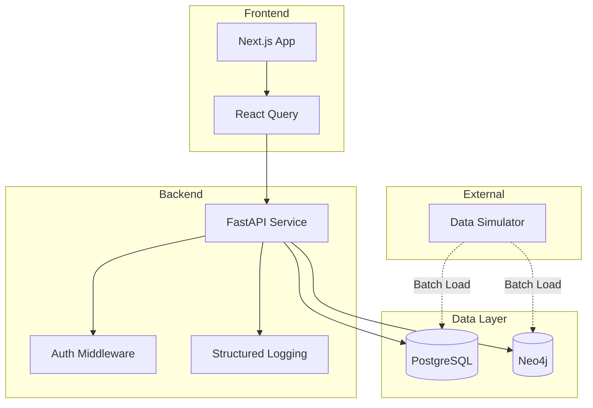
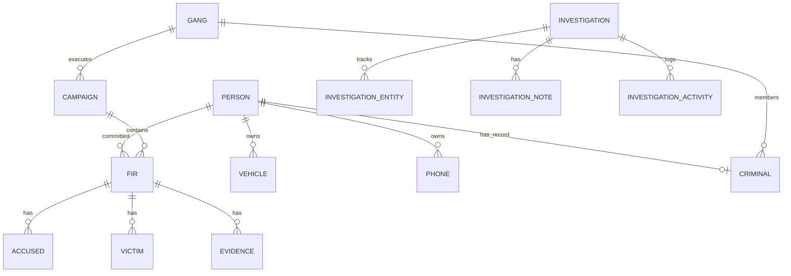
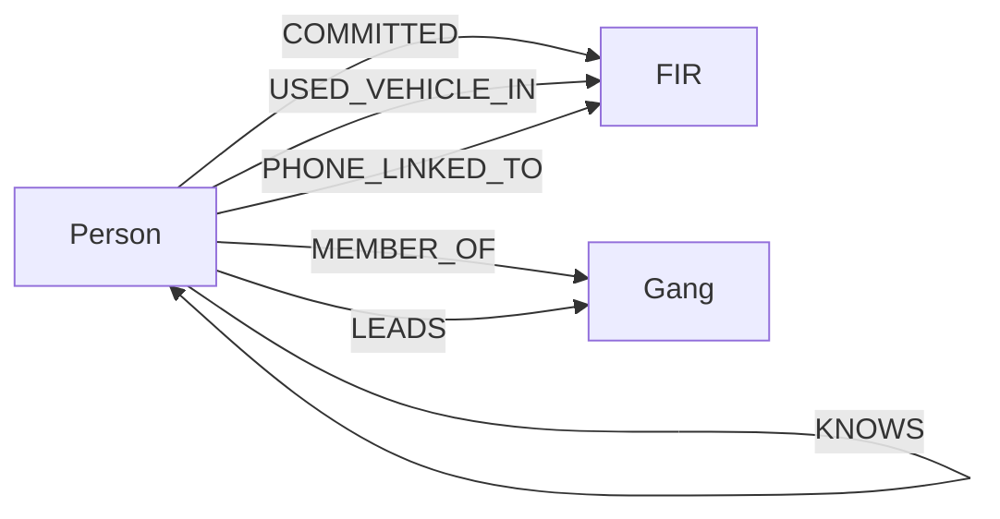

# NEXUS Platform Architecture

## System Overview

## Relational Entity-Relationship (Postgres)

## Graph Schema (Neo4j)

## Data Consistency Model
PostgreSQL acts as the single source of truth for entity attributes and primary keys. Neo4j acts as the topological index.
- All entities (Person, Vehicle, FIR) map 1:1 between Postgres and Neo4j using the same `id` strings.
- Frontend fetches relationship structure from Neo4j (e.g. Silo Buster) and enriches it with Postgres data (e.g. `useFIRDetail`).
