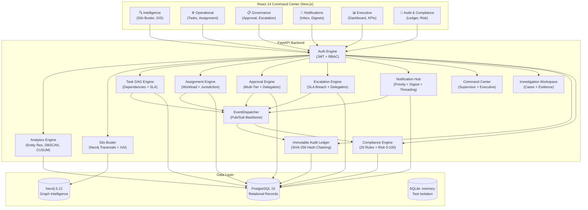
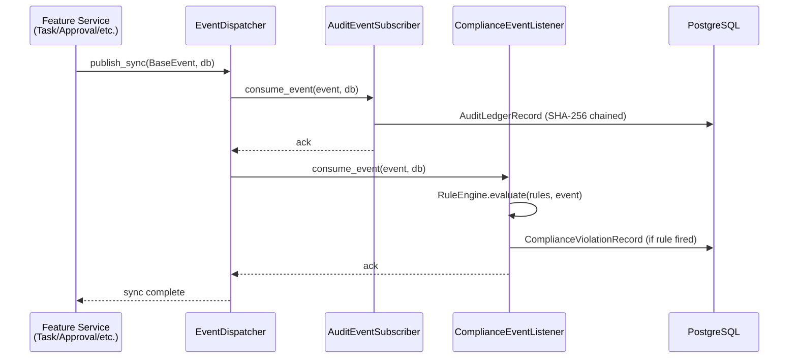
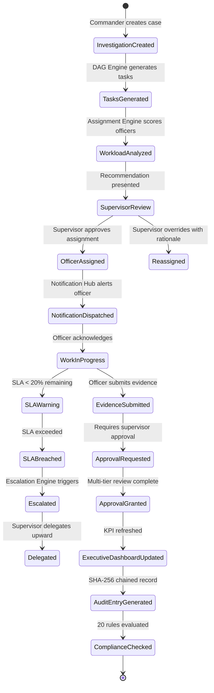
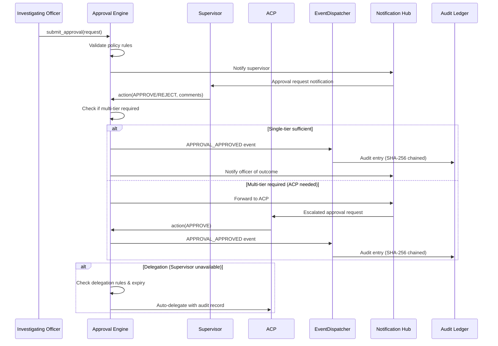
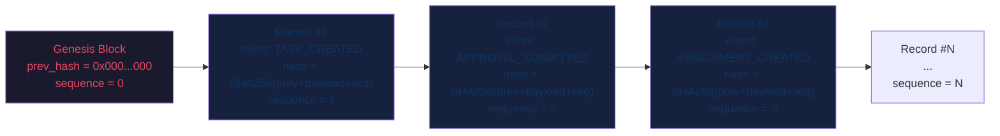

# NEXUS — Architecture Diagrams

## 1. Overall System Architecture

---

## 2. Event-Driven Backbone

---

## 3. Investigation Lifecycle

---

## 4. Approval Lifecycle

---

## 5. SHA-256 Audit Hash Chain

**Tamper Detection**: Any modification to any record changes its hash, breaking the chain for all subsequent records. The integrity sweep verifies every `prev_hash → hash` link in O(N).
