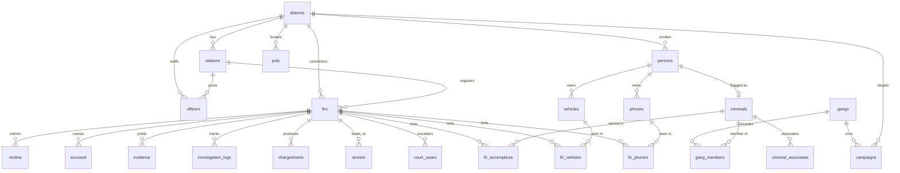

# NEXUS Relational Schema — Entity Relationships

Postgres schema defined in [`backend/db/schema.py`](../backend/db/schema.py).
32 hard foreign keys are enforced by the database; circular and polymorphic
references are soft (indexed, validated) — see [MIGRATION_PLAN.md](MIGRATION_PLAN.md).

## Core entity-relationship diagram

## Soft references (no DB-enforced FK)

| From | To | Why soft |
|---|---|---|
| criminals.gang_id | gangs.gang_id | Reference cycle with gangs.leader_criminal_id |
| gangs.leader_criminal_id | criminals.criminal_id | Reference cycle with criminals.gang_id |
| social_network (source/target) | persons / criminals | Polymorphic — endpoints span entity types |
| entity_resolution (ids) | multiple | Polymorphic match candidates |
| telemetry (cctv/anpr/cdr/gps/pings) | cameras / phones / vehicles | High-volume; integrity checked, not constrained |

Both cycle directions and all polymorphic edges are indexed for join performance and
verified by the validation pipeline (`check_fk_integrity` covers hard FKs;
soft refs are checked structurally).

## Fact table

`firs` is the central fact table — 1,000 rows fanning out to victims, accused,
evidence, investigation logs, chargesheets, arrests, court cases, and the three
FIR junction tables. Most analytical queries anchor here.
